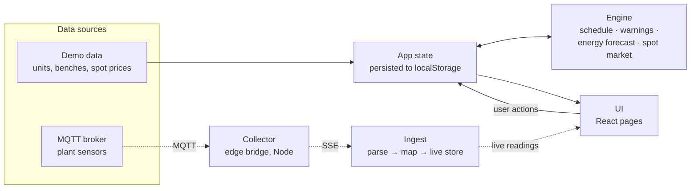
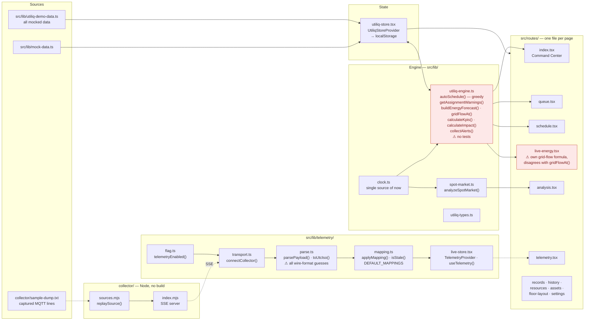
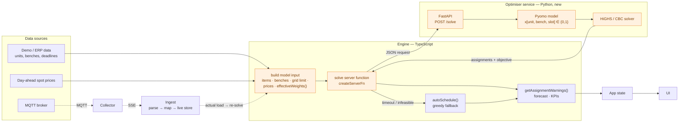

# Utiliq architecture

Three views of the same system, from coarse to fine:

1. **Level 1 — system**: the boxes and how data flows between them.
2. **Level 2 — modules**: the actual files and key functions behind each box.
3. **v2 — Pyomo optimiser (planned)**: where a mathematical optimiser replaces
   the current greedy scheduler.

Legend: solid arrow = always on · dashed arrow = live telemetry path, off unless
`VITE_TELEMETRY=1` · orange = planned, not built yet · red box = has a known issue
(see README *Known issues*).

---

## Level 1 — system

The app works end to end on demo data. The live path (dashed) is scaffolded
but has not yet been connected to a real broker. Live readings deliberately
stay **out** of the persisted app state.

---

## Level 2 — modules

Where to look first: `utiliq-engine.ts` is the heart of the product.
`parse.ts` and `mapping.ts` are the only files that need to change once the
real broker format is known.

---

## v2 — Pyomo optimiser (planned)

The greedy `autoSchedule()` handles units one at a time, in priority and
deadline order, and keeps the best-scoring bench × hour slot for each. It never
revisits earlier choices. v2 replaces it with a **MILP solved by Pyomo**. The
MILP weighs every unit, bench and slot together under the grid limit and spot
prices. Because Pyomo is Python, it runs as a separate service and the
TypeScript app calls it.

**Model sketch**

| | |
|---|---|
| Decision | `x[u,b,t] = 1` if unit *u* starts on bench *b* in slot *t* |
| Each unit once | Σb,t x[u,b,t] = 1 (or ≤ 1 with a penalty for leaving a unit unscheduled) |
| Compatibility | x = 0 wherever `isBenchCompatible(u, b)` is false |
| No overlap | at most one running test per bench per slot |
| Grid limit | Σ test power(t) − on-site generation(t) ≤ grid import limit, every slot |
| Deadlines | lateness ≥ end − deadline, penalised |
| Objective | minimise spot-price energy cost + lateness + curtailment, weighted by `effectiveWeights()` |

**Rollout:** keep `autoSchedule()` as the fallback and add the optimiser behind
a flag, the same way `VITE_TELEMETRY` gates live ingest. Compare both schedules
on the same input before switching the default.
